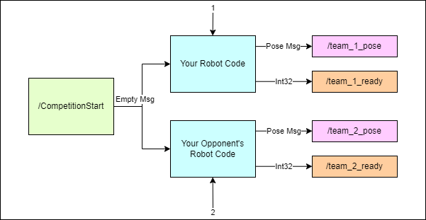
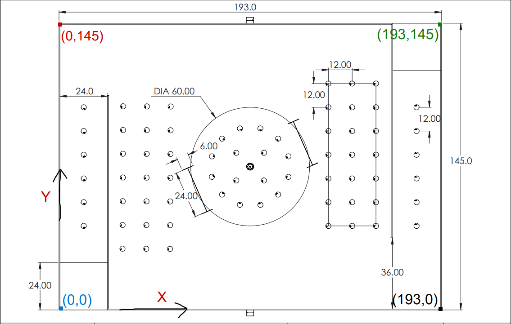
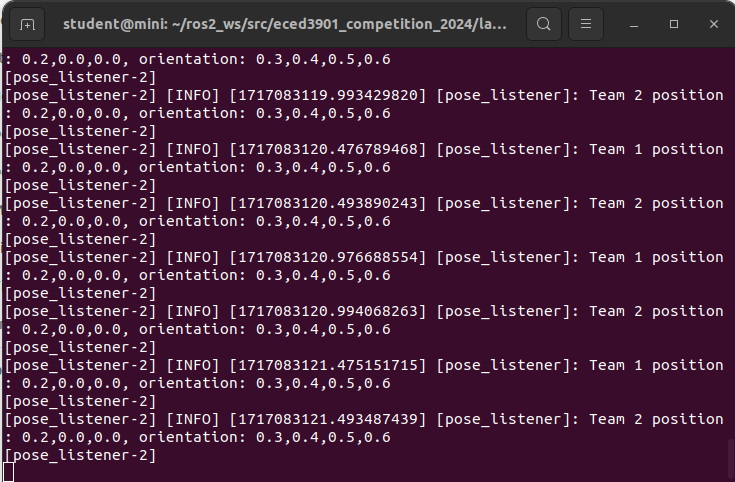

# ECED3901 Competition 2024
A ROS2 package to be used to connect both teams to the UI in the ECED3901 2024 competition



## Description

This package contains three python files:

 - **pose_listener:** This node should subscribe to your team's robot pose as '/team_1_pose' or '/team_2_pose' and print to console whenever it receives a message.
 
 - **competition_publisher:** Once the competition is started this node will continuously publish empty messages to '/CompetitionStart'
 
 - **test_student:** This node demonstrates what your robot should be doing to interact with these nodes.
 
 The final competition will require each team to interface with both of these pose_listener and competition_publisher nodes to ensure simultaneous competition start and constantly monitor the pose of both robots.

## Installation

To use this package, clone the repository into your ROS2 workspace and colcon build the package. The package should be on the same directory level as your eced3901 package.

```bash
cd /ros2_ws/src
git clone https://github.com/JasperGrant/ECED3901-Competition-2024
cd ..
colcon build
```


## Namespaces

To avoid topic collision, each team must have all of their topics outside of /CompetitionStart and /team_1_pose or /team_2_pose inside their own namespace. The naming convention is not strict as long as it has your team number in it. This is left intentionally vague so that a team cannot just publish malicious data to every other team number's namespaces.

An example of how to set a namespace for your nodes is shown below:

```bash

ros2 run my_package my_executable --ros-args --remap --namespace=/team_1_cool_namespace
```

The problem with using a namespace this way is that you will remap your CompetitionStart and pose topics to the /team_1_cool_namespace namespace. To avoid this you can remap these nodes in your namespace to the global ones. This is best done in a launch file. An example of how to do this is shown below:


```python
Node(
	package='eced3901_competition_2024',
    namespace='namespace_team_15',
	executable='test_student',
	name='team_15_robot',
	arguments='2',
	remappings=[
		('/namespace_team_15/team_2_pose', '/team_2_pose'),
		('/namespace_team_15/CompetitionStart', '/CompetitionStart')
	],
	output='screen'
)
```

If everything is working correctly your ros2 topic list should look like the following:


Notice the lack of /CompetitionStart, /team_1_pose, and /team_2_pose topics in the namespace. Only their global versions are shown. Every other topic from each robot is in their respective namespace.

To see this for yourself run the demo.launch.py file included in this repo.

## Pose Convention

To properly show the position of both robots on the UI a pose convention must be set. This convention is individual to each team so the opposing team will see the field with your (193,145) as their (0,0) and your 0 radians as their PI radians.

This is to say that each team will operate with their corner of origin as (0,0). We will perform the calculation to correct this in the UI, and you will only have to worry about the other team's orientation being flipped if you intend to use their pose data.

The x-axis will be the long side of the field and the y-axis will be the short side of the field. All coordinates are in inches.

While the orientation member of the pose message is typically a quaternion, we will take the /team_x_pose/orientation/z member to mean the robot's orientation about the z axis in radians. Here the X-axis represents the origin of 0 degrees and the angle in radians is measured in the counter-clockwise direction. This should be wrapped between -PI and PI. Exactly like the unit circle. Keep in mind this will also be flipped between teams but you only need to worry about your own team's orientation.





## Testing

### Communication with Competition Nodes

Follow the instructions below to test the communication between your robot and the competition nodes.

1. Start the pose_listener node by running the following command:

```bash
ros2 run eced3901_competition_2024 pose_listener
```

You should not see any output.

2. Start your robot node. The robot node should publish its pose to the topic '/team_1_pose' or '/team_2_pose' depending on your team number.

The test_student node can be used to simulate the robot node. To start the test_student node, run the following command:

```bash
ros2 run eced3901_competition_2024 test_student 1
```

**OR** 

```bash
ros2 run eced3901_competition_2024 test_student 2
```

You should still not see any output from the pose_listener node.

3. Start the competition_publisher node by running the following command:

```bash
ros2 run eced3901_competition_2024 competition_publisher
```

You should see the pose of your robot being printed to the console by the pose_listener node.

An example below shows both test_student robots running at the same time:



**NOTE:** Make sure that your robot can easily be changed from team 1 to team 2 by changing the topic it publishes to. This will be required for the final competition. A good way to do this is as an argument for the program or launch file of 1 or 2.

## FAQ

**Q: I am changing my code but the changes are not showing up?**
A: Delete the build and install folders in /ros2_ws and rebuild the package. Either your executables will be built from the newest version or they will fail to build and you can see the error messages.